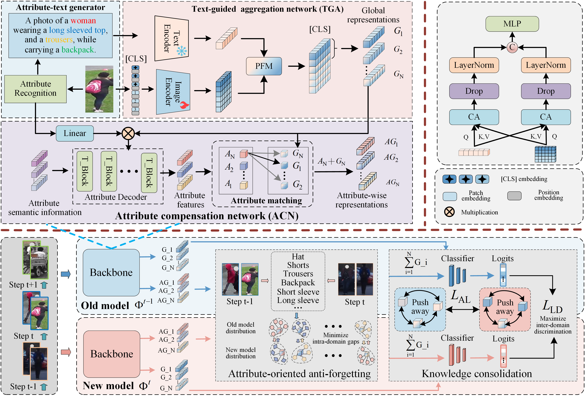

## Domain Consistency Representation Learning for Lifelong Person Re-Identification (DCR)

<div align="center"> 
  
[](https://arxiv.org/abs/2409.19954)

</div>

### Introduction

```
Our work proposes a “Domain Consistency Representation Learning for Lifelong Person Re-Identification” (DCR). The proposed DRE explores global and attribute-wise representations to capture individual nuances in intra-domain and inter-domain consistency, achieving a trade-off between maximizing intra-domain discrimination and minimizing inter-domain gaps.
```


### Dataset preparation

- Please follow [Torchreid_Datasets_Doc](https://kaiyangzhou.github.io/deep-person-reid/datasets.html) to download datasets and unzip them to your data path .
- Prepare the Seen dataset structure as follow:   ./docs/seen dataset_structure .md
- Prepare the Unseen dataset structure as follow:  ./docs/Unseen dataset_structure .md
### Prepare ViT Pre-trained Models

You need to download the ImageNet pretrained transformer model : [ViT-Base](https://github.com/rwightman/pytorch-image-models/releases/download/v0.1-vitjx/jx_vit_base_p16_224-80ecf9dd.pth).

### Training

Training order-1 for training.

```
python continual_train(order1).py --data-dir=/your seen dataset path
```

Training order-2 for training.

```
python continual_train(order2).py --data-dir=/your seen dataset path
```

## Acknowledgement

- Diverse Representations Embedding for Lifelong Person Re-Identification  [DRE](https://github.com/LiuShiBen/DRE).
- Lifelong Person Re-Identification via Knowledge Refreshing and Consolidation  [KRKC](https://github.com/cly234/LReID-KRKC).
